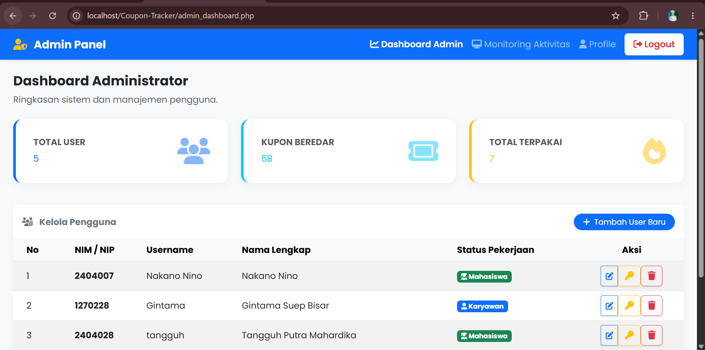

<div align="center">

# 🎟️ Sistem Manajemen Kupon Makan

### Personal & Multi-User Coupon Tracker built with PHP Native, MySQL, Bootstrap 5, and SweetAlert2.

Aplikasi web interaktif untuk melacak, memonitor, dan mengelola kupon makan RFID secara *real-time*. Didesain khusus dengan tema **Politeknik Gajah Tunggal / PT Gajah Tunggal Tbk**. 🐘✨

<br>


<br>

[✨ Fitur](#-fitur-unggulan) •
[🔒 Keamanan](#-security-notes) •
[🧩 Modul](#-modul-aplikasi) •
[📁 Struktur](#-struktur-folder) •
[💡 Logika FEFO](#-logika-sistem-fefo) •
[⚙️ Instalasi](#️-panduan-instalasi) •
[🔑 Akun Default](#-akun-default-untuk-pengujian) •
[🚀 Cara Pakai](#-cara-menggunakan) •
[🖼️ Preview](#️-preview-aplikasi)

</div>

---

## 📌 Tentang Project

**Sistem Manajemen Kupon Makan** adalah aplikasi yang bertindak sebagai **Dompet Digital Kupon** pintar.

Karena jatah kupon dari perusahaan dihitung berdasarkan hari kerja dan memiliki rentang masa kedaluwarsa, aplikasi ini dirancang untuk memastikan hak kupon bulanan Anda tidak ada yang hangus atau terlewat. Dilengkapi dengan logika *First-Expired, First-Out* (FEFO), analitik tren pemakaian bulanan, panel admin untuk manajemen pengguna, hingga proteksi keamanan tingkat tinggi (Anti-SQLi, CSRF Guard, Rate Limiting).

> Didedikasikan khusus untuk penggunaan mahasiswa/karyawan selama masa pendidikan/kerja di **PT Gajah Tunggal Tbk**.

---

## ✨ Fitur Unggulan

<table>
  <tr>
    <td width="33%">
      <h3>💳 Saldo & Sistem FEFO</h3>
      <p>Kalkulasi otomatis sisa kupon bersih. Pemotongan kupon otomatis memprioritaskan batch kupon yang paling cepat kedaluwarsa (First-Expired, First-Out).</p>
    </td>
    <td width="33%">
      <h3>⏳ Smart Expiration</h3>
      <p>Sistem cerdas yang secara bawaan mengatur masa kedaluwarsa kupon tepat 2 bulan setelah tanggal jatah kupon diinputkan.</p>
    </td>
    <td width="33%">
      <h3>🔐 Login via NIM/NIP</h3>
      <p>Autentikasi menggunakan NIM/NIP dan kata sandi yang dienkripsi menggunakan <i>Bcrypt Hashing</i>, dilengkapi perlindungan rate limiting anti-brute force.</p>
    </td>
  </tr>
  <tr>
    <td width="33%">
      <h3>📊 Dashboard Insights</h3>
      <p>Pantau tren pengeluaran! Menampilkan perbandingan total pemakaian kupon bulan ini dengan bulan sebelumnya secara <i>real-time</i>.</p>
    </td>
    <td width="33%">
      <h3>🛡️ Panel Administrator</h3>
      <p>Kelola seluruh pengguna (tambah, edit, hapus, reset password), serta monitor aktivitas transaksi kupon secara global di kantin.</p>
    </td>
    <td width="33%">
      <h3>🎨 Modern & Interaktif</h3>
      <p>UI elegan beridentitas Biru Dongker Poltek GT, animasi <i>ScrollReveal.js</i>, dan dialog konfirmasi interaktif <i>SweetAlert2</i>.</p>
    </td>
  </tr>
</table>

---

## 🔒 Security Notes

Aplikasi ini telah melalui proses *Security Hardening* yang ketat:

1. **Anti-SQL Injection (100% Prepared Statements)**: Seluruh interaksi database yang menerima input pengguna atau session menggunakan `mysqli::prepare` dan `bind_param`.
2. **Perlindungan CSRF (Cross-Site Request Forgery)**: Helper `csrf.php` menghasilkan token kriptografis 64-karakter hex. Seluruh aksi manipulasi data (`POST`) wajib membawa token valid yang diverifikasi menggunakan perbandingan timing-safe (`hash_equals`).
3. **Konversi Aksi Berbahaya ke POST**: Tidak ada lagi aksi state-changing (hapus, reset password, tandai selesai) yang bisa dieksekusi murni via link GET.
4. **Rate Limiting Login**: Menghindari serangan *brute-force* password menggunakan kombinasi hash `NIM + IP Address`. Gagal login ≥ 5 kali dalam 15 menit akan diblokir sementara.
5. **Session Hardening**: `session_config.php` menerapkan flag cookie `HttpOnly`, `SameSite=Lax`, dan `Secure`. Terdapat `session_regenerate_id(true)` saat login sukses untuk mencegah *Session Fixation*.
6. **Kebijakan Password Wajib**: Password baru minimal 8 karakter (kombinasi huruf dan angka). Akun baru & hasil reset wajib memperbarui password saat pertama kali login (`must_change_password`).
7. **Proteksi Server Apache (`.htaccess`)**: Mencegah *directory browsing*, memblokir akses langsung ke file konfigurasi (`config.php`), folder `database/`, folder `.git/`, dan ekstensi `.sql`, `.env`, `.md`, `.log`.

> 📖 **PENTING UNTUK PEMILIK REPOSITORI:** Baca panduan pembersihan riwayat Git lama di dokumen [SECURITY.md](SECURITY.md) sebelum mempublikasikan repositori ini ke GitHub!

---

## 🧩 Modul Aplikasi

| Modul | Deskripsi |
|---|---|
| 🔐 **Auth & Security** | Login via NIM/NIP, Bcrypt hash, rate limiting, session fixation protection, CSRF guard. |
| 🏠 **Dashboard Pengguna** | Ringkasan saldo aktif, kupon terpakai, insight tren pemakaian, form jatah, dan histori kupon. |
| 📥 **Input Pemasukan** | Penambahan jatah kupon bulanan dengan pencegahan duplikasi input di bulan yang sama. |
| 📤 **Catat Pemakaian** | Pemakaian kupon dengan validasi saldo (mencegah minus), opsi status (Selesai/Pending), dan catatan. |
| ⚙️ **Mesin FEFO** | Algoritma pemotongan saldo kupon yang paling cepat kedaluwarsa secara otomatis dan akurat. |
| 👤 **Profile User & Admin** | Tampilan data profil terverifikasi dan form ganti password berproteksi kebijakan kata sandi. |
| 👑 **Panel Admin** | Statistik kupon global, kelola master user (tambah/edit/hapus/reset sandi), dan log monitoring. |

---

## 🛠️ Tech Stack

| Kategori | Teknologi |
|---|---|
| **Backend** | PHP Native (Procedural & OOP MySQLi) |
| **Database** | MySQL / MariaDB (Prepared Statements) |
| **Frontend** | HTML5, CSS3, JavaScript (ES6) |
| **UI Framework** | Bootstrap 5 (CDN) |
| **Animations & Alerts** | ScrollReveal.js, SweetAlert2 |
| **Web Server** | Apache (XAMPP / Laragon) |

---

## 📁 Struktur Folder

```text
Coupon-Tracker/
├── assets/                    # Aset statis (CSS, tema warna, gambar preview)
│   ├── css/
│   │   └── style.css          # Tema warna Poltek GT & custom styling
│   └── img/                   # Tangkapan layar preview aplikasi
├── database/
│   └── schema.sql             # Skema DDL & data seeder fiktif default
├── config.example.php         # Template kredensial database (commit-safe)
├── config.php                 # Kredensial lokal (diabaikan oleh .gitignore)
├── koneksi.php                # Handler koneksi MySQLi berbasis config.php
├── session_config.php         # Konfigurasi cookie session terpusat yang aman
├── csrf.php                   # Helper generator & verifikator token CSRF
├── index.php                  # Entry point & role-aware session router
├── login.php                  # Halaman autentikasi NIM/NIP & brute-force rate limit
├── logout.php                 # Handler pembersihan sesi & cookie
├── dashboard.php              # Dashboard utama mahasiswa/karyawan
├── profile.php                # Profil pengguna & form ganti sandi
├── admin_dashboard.php        # Panel kendali admin & CRUD pengguna
├── admin_monitoring.php       # Monitoring transaksi kupon makan global
├── admin_profile.php          # Profil akun administrator & form ganti sandi
├── proses_tambah_jatah.php    # Backend input kupon & validasi 1x sebulan
├── proses_pakai_kupon.php     # Backend pemakaian kupon & algoritma FEFO
├── proses_selesai.php         # Backend update status pending ke selesai (POST)
├── proses_hapus.php           # Backend hapus data & refund saldo otomatis (POST)
├── proses_admin_user.php      # Backend CRUD user & reset password admin (POST)
├── proses_edit_password.php   # Backend ubah password & validasi kebijakan (POST)
├── .htaccess                  # Proteksi akses direktori & file sensitif
├── .gitignore                 # Konfigurasi pengabaian file rahasia/lokal
├── SECURITY.md                # Panduan keamanan & pembersihan riwayat Git
└── README.md                  # Dokumentasi utama proyek
```

---

## 💡 Logika Sistem FEFO

Aplikasi ini mengimplementasikan algoritma **First-Expired, First-Out (FEFO)**:

> **Skenario:** Anda memiliki sisa 10 kupon dari batch Agustus (*expired* 1 Okt). Pada 1 September, Anda memasukkan jatah baru 20 kupon (*expired* 1 Nov). Total saldo = **30 kupon**.
>
> **Transaksi:** Pada 2 September, Anda mencatat pemakaian sebanyak 15 kupon di kantin.
>
> **Hasil Eksekusi FEFO:**
> 1. Sistem mengurutkan batch kupon berdasarkan `tanggal_expired ASC`.
> 2. Batch Agustus (10 kupon) dipotong habis → sisa = **0**.
> 3. Sisa kebutuhan (5 kupon) dipotong dari batch September → sisa = **15**.
> - Kupon yang hampir hangus selalu aman terpakai lebih dulu! ✅

---

## ⚙️ Panduan Instalasi

### 1️⃣ Clone Repository

Buka terminal di direktori web root Anda (`C:\laragon\www\` atau `C:\xampp\htdocs\`):

```bash
git clone https://github.com/<username>/Coupon-Tracker.git
cd Coupon-Tracker
```

### 2️⃣ Konfigurasi Database Kredensial

Salin file template konfigurasi menjadi `config.php`:

```bash
cp config.example.php config.php
```

Buka `config.php` dan sesuaikan dengan pengaturan MySQL lokal Anda:

```php
return [
    'host'     => 'localhost',
    'username' => 'root',
    'password' => '',             // Kosongkan jika default Laragon/XAMPP
    'database' => 'db_kupon_makan',
];
```

### 3️⃣ Import Skema Database

Import file `database/schema.sql` ke MySQL melalui phpMyAdmin atau terminal CLI:

```bash
mysql -u root -p < database/schema.sql
```

### 4️⃣ Jalankan Aplikasi! 🎉

Buka browser dan akses URL:

👉 `http://localhost/Coupon-Tracker/`

---

## 🔑 Akun Default untuk Pengujian

Database seeder `schema.sql` menyediakan beberapa akun pengujian fiktif:

| Peran (Role) | NIM / Username | Password Default | Keterangan |
|---|---|---|---|
| **Administrator** | `ADMIN001` | `ADMIN001` | Akses penuh ke Panel Admin (`admin_dashboard.php`) |
| **Mahasiswa** | `2400001` | `2400001` | Akses Dashboard User (`dashboard.php`) |
| **Mahasiswa** | `2400002` | `2400002` | Akun mahasiswa pendamping untuk uji transfer/isolasi |
| **Karyawan** | `1990001` | `1990001` | Akun tipe Karyawan (Label NIP aktif) |

> ⚠️ **Catatan:** Seluruh akun default memiliki flag `must_change_password = 1`. Saat pertama kali login, modal SweetAlert2 akan mewajibkan pengguna mengganti kata sandi default demi keamanan.

---

## 🚀 Cara Menggunakan

1. **Login** menggunakan NIM/NIP dan Password.
2. Di awal bulan, masukkan jatah kupon pada form **Input Jatah Kupon**. Sistem otomatis menentukan masa berlaku 2 bulan ke depan.
3. Setiap kali makan di kantin, catat pada form **Catat Pemakaian Kupon**, pilih status (*Selesai* atau *Pending* jika direncanakan untuk besok).
4. Pantau tren pengeluaran Anda melalui kartu **Insight** bulanan.
5. Anda dapat menandai kupon *Pending* menjadi *Selesai* dengan mengklik ikon centang hijau di riwayat pemakaian.

---

## 🖼️ Preview Aplikasi

> **Note:** Simpan screenshot aplikasi ke folder `/assets/img/` di repo Anda agar gambar di bawah ini muncul.

<table>
  <tr>
    <td align="center" width="50%">
      
      <br>
      <b>🔐 Halaman Login</b>
      <br>
      <sub>Akses masuk aman menggunakan NIM/NIP & Password.</sub>
    </td>
    <td align="center" width="50%">
      
      <br>
      <b>🖥️ Dashboard Desktop</b>
      <br>
      <sub>Ringkasan kupon, insight tren bulanan, dan riwayat pemakaian.</sub>
    </td>
  </tr>
  <tr>
    <td align="center" width="50%">
      
      <br>
      <b>👤 Halaman Profil</b>
      <br>
      <sub>Manajemen profil diri dan ganti kata sandi.</sub>
    </td>
    <td align="center" width="50%">
      
      <br>
      <b>👑 Panel Admin & Monitoring</b>
      <br>
      <sub>Statistik kupon global dan kelola pengguna via tampilan desktop.</sub>
    </td>
  </tr>
</table>

---

## 🧾 Lisensi

Proyek ini dirilis di bawah lisensi **MIT**.

---

## 👨‍💻 Pengembang

**Najwan Caesar Firstiansyah**

[](https://github.com/najwancf)

<div align="center">

**Built with ❤️ using PHP Native + MySQL.**

</div>
