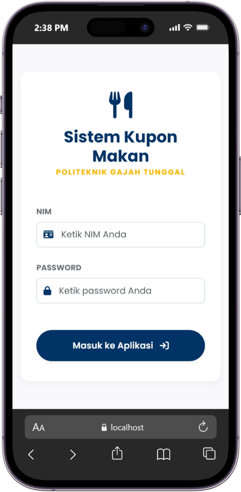
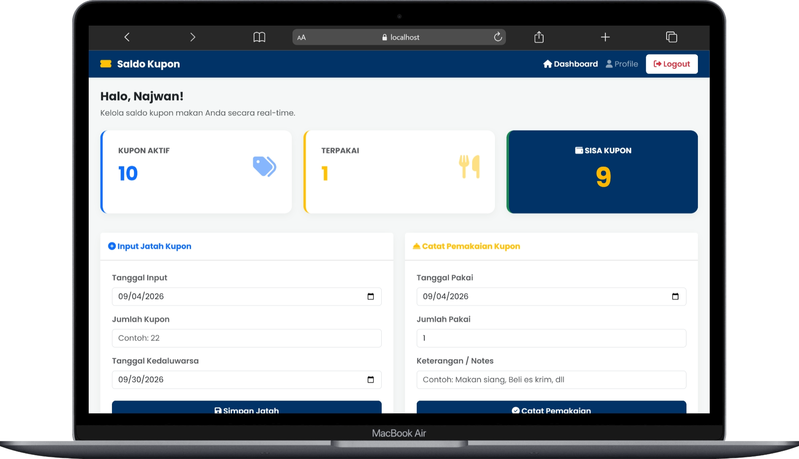
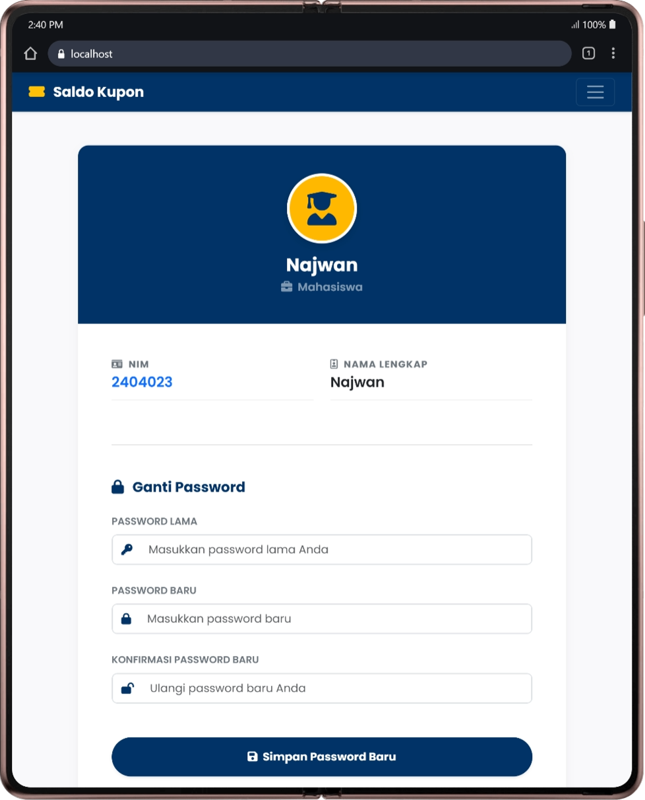

<div align="center">

# 🎟️ Sistem Manajemen Kupon Makan

### Personal coupon tracker dashboard built with PHP Native, MySQL, Bootstrap 5, and SweetAlert2.

Aplikasi web interaktif untuk melacak, memonitor, dan memanajemen sisa kupon makan RFID perusahaan secara *real-time*. Didesain khusus dengan tema **Politeknik Gajah Tunggal / PT Gajah Tunggal Tbk**. 🐘✨

<br>


<br>

[✨ Fitur](#-fitur-unggulan) •
[🧩 Modul](#-modul-aplikasi) •
[🛠️ Tech Stack](#️-tech-stack) •
[📁 Struktur](#-struktur-folder) •
[💡 Logika FIFO](#-logika-sistem-fifo) •
[⚙️ Instalasi](#️-panduan-instalasi) •
[🚀 Cara Pakai](#-cara-menggunakan) •
[🗺️ Roadmap](#️-roadmap) •
[🖼️ Preview](#️-preview-aplikasi)

</div>

---

## 📌 Tentang Project

**Sistem Manajemen Kupon Makan** adalah aplikasi yang bertindak sebagai **Dompet Digital Kupon** pribadi.

Karena jatah kupon dari perusahaan dihitung berdasarkan hari kerja dan memiliki rentang masa kedaluwarsa, aplikasi ini dirancang untuk memastikan hak kupon bulanan Anda tidak ada yang hangus atau terlewat. Dilengkapi dengan logika *First-In, First-Out* (FIFO), analitik pemakaian bulanan, hingga proteksi sesi berbasis NIM.

> Didedikasikan khusus untuk penggunaan pribadi mahasiswa/karyawan selama masa pendidikan/kerja di **PT Gajah Tunggal Tbk**.

---

## ✨ Fitur Unggulan

<table>
  <tr>
    <td width="33%">
      <h3>💳 Saldo & Sistem FIFO</h3>
      <p>Kalkulasi otomatis sisa kupon bersih. Pemakaian kupon otomatis memotong jatah kupon yang masa kedaluwarsanya paling dekat (First-In, First-Out).</p>
    </td>
    <td width="33%">
      <h3>⏳ Smart Expiration</h3>
      <p>Sistem cerdas yang otomatis mengatur masa kedaluwarsa kupon tepat 2 bulan setelah tanggal jatah kupon tersebut diinputkan.</p>
    </td>
    <td width="33%">
      <h3>🔐 Login via NIM</h3>
      <p>Autentikasi menggunakan Nomor Induk Mahasiswa (NIM) dan password yang dienkripsi ketat menggunakan <i>Bcrypt Hashing</i>.</p>
    </td>
  </tr>
  <tr>
    <td width="33%">
      <h3>📊 Dashboard Insights</h3>
      <p>Pantau tren pengeluaran! Menampilkan perbandingan total pemakaian kupon bulan ini dengan bulan sebelumnya secara <i>real-time</i>.</p>
    </td>
    <td width="33%">
      <h3>📝 Catatan Pemakaian</h3>
      <p>Bukan sekadar angka, tambahkan catatan (notes) untuk apa kupon tersebut dipakai (misal: "Makan Siang", "Beli Es Krim", dll).</p>
    </td>
    <td width="33%">
      <h3>🎨 Modern & Interaktif</h3>
      <p>UI elegan mengusung identitas warna Biru Dongker Poltek GT, dilengkapi animasi <i>ScrollReveal.js</i> dan <i>pop-up SweetAlert2</i>.</p>
    </td>
  </tr>
</table>

---

## 🧩 Modul Aplikasi

| Modul | Deskripsi |
|---|---|
| 🔐 **Auth & Security** | Login via NIM, hashing password, session guard, welcome pop-up, & logout confirmation. |
| 🏠 **Dashboard Utama** | Ringkasan saldo aktif, kupon terpakai bulan ini, insight tren pemakaian, dan tabel riwayat. |
| 📥 **Input Pemasukan** | Penambahan jatah kupon bulanan dengan validasi *max date* hari ini dan kalkulasi *expired date*. |
| 📤 **Catat Pemakaian** | Form pemakaian kupon dengan validasi saldo (mencegah minus) dan input keterangan/notes. |
| ⚙️ **Mesin FIFO** | Algoritma *backend* yang melooping dan memotong saldo dari *batch* kupon terlama secara otomatis. |
| 👤 **Profile User** | Menampilkan NIM, Nama, Status Pekerjaan, serta form terproteksi untuk Ganti Password. |

---

## 🛠️ Tech Stack

| Kategori | Teknologi |
|---|---|
| **Backend** | PHP Native |
| **Database** | MySQL / MariaDB |
| **Frontend** | HTML5, CSS3 (Custom Properties), JavaScript |
| **UI Framework** | Bootstrap 5 (CDN) |
| **Animations & Alerts** | ScrollReveal.js, SweetAlert2 |
| **Local Server** | XAMPP / Laragon |

---

## 📁 Struktur Folder

```text
kupon-makan/
├── assets/                   # Folder untuk custom CSS dan gambar
│   ├── css/
│   │   └── style.css         # Tema khusus Poltek GT & efek Hover
│   └── img/
├── koneksi.php                # Jembatan koneksi PHP ke MySQL
├── index.php                  # Entry point & session routing
├── login.php                  # Antarmuka dan logika autentikasi NIM
├── dashboard.php               # Halaman utama aplikasi (Insights & Forms)
├── proses_tambah_jatah.php     # Backend penambahan kupon & kalkulasi masa aktif
├── proses_pakai_kupon.php      # Masterpiece Backend: Algoritma FIFO & validasi saldo
├── profile.php                 # Halaman data diri & form ubah sandi
├── proses_edit_pass.php        # Backend validasi dan update password hash
└── logout.php                  # Logika penghancuran sesi & SweetAlert
```

---

## 💡 Logika Sistem FIFO

Aplikasi ini menggunakan sistem **First-In, First-Out (FIFO)** untuk memastikan kupon tidak hangus sia-sia:

> **Kasus:** Anda punya sisa 10 kupon dari bulan Agustus (*expired* 1 Okt). Lalu pada 1 September, Anda input jatah baru sebanyak 20 kupon (*expired* 1 Nov). Total saldo = **30**.
>
> **Eksekusi:** Pada tanggal 2 September Anda makan menggunakan 2 kupon.
>
> **Hasil Backend:** Sistem akan mencari kupon mana yang paling cepat kedaluwarsa, lalu memotong 2 kupon dari *batch* Agustus.
> - Sisa kupon Agustus = **8**
> - Sisa kupon September = **20**
>
> Jauh lebih aman dan akurat! ✅

---

## ⚙️ Panduan Instalasi

### 1️⃣ Clone Repository

Buka terminal di dalam folder `C:\laragon\www\` atau `C:\xampp\htdocs\`:

```bash
git clone https://github.com/najwancf/nama-repo-kamu.git kupon-makan
```

> Ubah URL di atas dengan link repo GitHub Anda.

### 2️⃣ Setup Database

1. Buka `http://localhost/phpmyadmin`
2. Buat database baru bernama `db_kupon_makan`
3. Import file `database.sql` (jika tersedia di repo) atau jalankan query DDL yang ada

### 3️⃣ Konfigurasi Koneksi

Buka `koneksi.php` dan sesuaikan kredensial server lokal Anda:

```php
$host = "localhost";
$user = "root";
$pass = ""; // Kosongkan jika default XAMPP/Laragon
$db   = "db_kupon_makan";
```

### 4️⃣ Jalankan Aplikasi! 🎉

Buka browser dan akses:

👉 `http://localhost/kupon-makan/`

**Akun Default untuk Testing:**

| Field | Value |
|---|---|
| NIM | `2404023` |
| Password | `123456` |

---

## 🚀 Cara Menggunakan

1. **Login** menggunakan NIM dan Password.
2. Di awal bulan, masukkan jatah kupon pada form **Input Jatah Kupon Bulanan**. Sistem otomatis mematok waktu 2 bulan sebelum hangus.
3. Sehabis Tap In/Out kantin, langsung catat pada form **Catat Pemakaian Kupon**, isi nominal dan catatan (*notes*).
4. Pantau grafik naik-turun pengeluaran Anda lewat kartu **Insight** bulanan.
5. Ganti password default Anda melalui menu **Profile** untuk keamanan.

---

## 🗺️ Roadmap

- [ ] Export riwayat pemakaian ke PDF/Excel
- [ ] Opsi hapus/edit catatan riwayat jika terjadi salah input
- [ ] Dark Mode terintegrasi
- [ ] Notifikasi otomatis 7 hari sebelum ada kupon yang akan kedaluwarsa

---

## 🖼️ Preview Aplikasi

> **Note:** Simpan screenshot aplikasi ke folder `/assets/img/` di repo Anda agar gambar di bawah ini muncul.

<table>
  <tr>
    <td align="center" width="50%">
      
      <br>
      <b>🔐 Halaman Login</b>
      <br>
      <sub>Akses masuk aman menggunakan NIM & Password.</sub>
    </td>
    <td align="center" width="50%">
      
      <br>
      <b>🖥️ Dashboard Desktop</b>
      <br>
      <sub>Ringkasan kupon, insight tren bulanan, dan riwayat pemakaian.</sub>
    </td>
  </tr>
  <tr>
    <td align="center" width="50%">
      
      <br>
      <b>👤 Halaman Profil</b>
      <br>
      <sub>Manajemen profil diri dan ganti kata sandi.</sub>
    </td>
    <td align="center" width="50%">
      
      <br>
      <b>💻Dashboard With Desktop</b>
      <br>
      <sub>Tampilan responsif, tetap rapi diakses lewat Desktop.</sub>
    </td>
  </tr>
</table>

---

## 🧾 Lisensi

Project ini menggunakan lisensi **MIT**.
Dirancang sebagai bahan pembelajaran pribadi dan implementasi manajemen data operasional.

---

## 👨‍💻 Author

**Najwan Caesar Firstiansyah**

[](https://github.com/najwancf)

---

<div align="center">

### ⭐ Sistem Manajemen Kupon Makan

Jika project ini bermanfaat atau memberi inspirasi, jangan lupa tinggalkan star di repository ini!

**Built with ❤️ using PHP Native + MySQL.**

</div>